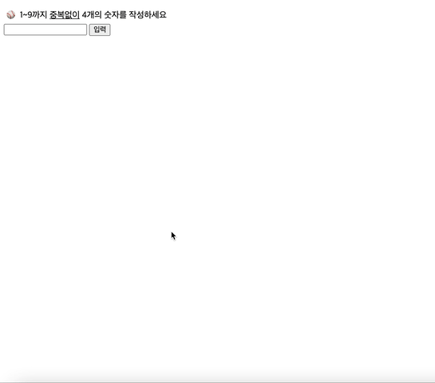
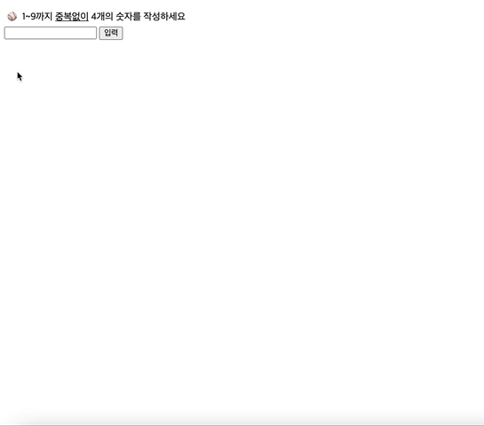

<h1 align='middle'>숫자야구게임</h1>

## 👨🏻‍💻프로그램 실행결과 ##

### 1) 정상작동



### 2) alert표시


## 순서도
```js
1. 프로그램이 무작위 숫자 4개 선택
2. 플레이어는 숫자 4개를 입력한다.
3. 플레이어가 입력한 숫자가 (4글자가 아닌지),(중복된 숫자가 있는지),(이미 입력받은 값인지)
(Y)
    alert
    2번으로
4. 홈런인가?
(Y)
    성공표시
    종료
5. 실행횟수가 10번을 넘었는가?
(Y)
    실패표시
    종료
(N)
    볼/스트라이크 표시
    2번으로
    
```