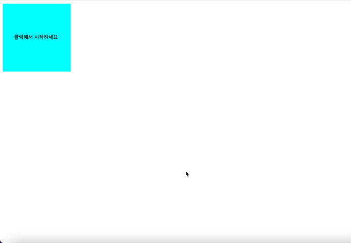

<h1 align='middle'>👻 반응속도 테스트</h1>

## 실행결과




## 🚦 순서도
```js
1. 화면을 클릭한다.
1-1. if 파란화면
    1) 빨간화면으로 전환
    2) 랜덤 카운트 다운(1000ms~3000ms)
    3) 초록화면 보여줌과 동시에 시작시간 저장
1-2. else if 빨간화면
    1) 경고창과 함께 파란화면으로 전환
1-3. else if 초록화면
    1) 종료시간 저장
    2) (종료시간-시작시간)과 평균시간을 화면에 보여줌
    3) 상위 5개 시간을 나열해서 보여줌
    4) 파란화면
```