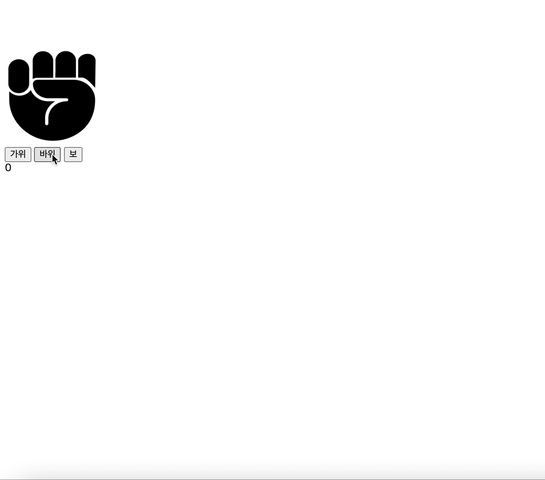

<h1 align='middle'> ✌️👊🖐 가위바위보 게임

## 👨🏻‍💻프로그램 실행결과 ##



## 🚦 순서도
```js
1. 화면에 가위바위보 그림이 빠르게 돌아간다.
2. 사용자가 가위바위보 버튼 중 택1을 하면 그림이 멈춘다.
3. 승패유무를 가려 점수를 표시한다.
4. 플레이어 또는 컴퓨터중 3승을 먼저한 쪽이 이긴다. -> 프로그램 종료
5. 1번~3번 반복한다.

```