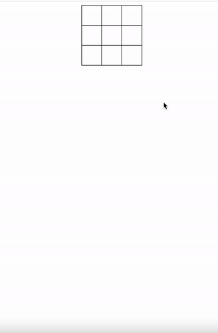

<h1 align='middle'> 🤖 틱택토 게임</h1>

## 👨🏻‍💻 실행결과




## 🚦 순서도
```js
1. 오목판 2차원 배열을 만든다.
2. 칸을 클릭한다.
3. 칸이 비어있는가?
(Y)
    현재차례(O or X)를 칸에 넣는다.
(N)
    대기
4. 승부가 났는가?
(Y)
    승자를 표시한다.
    종료
(N)
    5. 무승부인가?
    (Y)
        무승부를 표시한다.
        종료
    (N)
        차례를 넘긴다.
        대기
```

### array.prototype.flat()

- `flat()` 메서드는 **모든 하위 배열요소를** 지정한 깊이까지 재귀적으로 이어붙인 새로운 배열을 생성한다.

- 구문
```js
const newArr() = arr.flat([depth])
```
- 매개변수

    - depth : 깊이 값, 기본값은 1
    - 반환값 : 하위 배열을 이어붙인 새로운 배열
- 예시
```js
const array = [1,2,[3,4]]
console.log(array.flat())//[1,2,3,4]

const array = [1,2,[[3,4],[5,6]]]
console.log(array.flat())//[1,2,[3,4],[5,6]]
console.log(array.flat(2))//[1,2,3,4,5,6]

```

- [출처-MDN](https://developer.mozilla.org/ko/docs/Web/JavaScript/Reference/Global_Objects/Array/flat)