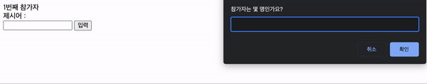
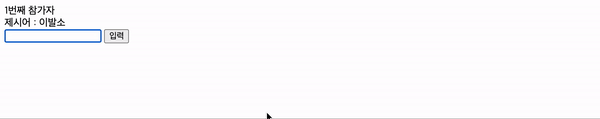

<h1 align="middle">
    끝말잇기 </h1>

## 👨🏻‍💻프로그램 실행결과 ##

### 1) 참가자릴레이



### 2) 경고창



## 🚦구현순서
```js
1. 몇 명이 참가할것인지
2. 제시어 생성
3. 입력단어 가져오기
4. 입력버튼 클릭
5-1.제시어가 비어있거나 두 단어가 이어지는가
    1)입력단어를 제시어로 변경
    2)다음참가자번호로 표시
5-2.올바르지않다면
    1)경고창을 표시한다.
6.입력창을 포커스하고 빈 공백으로 처리
7. 4번 반복
```
## 📌 규칙

1) 태그를 저장하는 변수명은 `$`로 시작.
2) 태그내부의 값을 가져올 때는 `textContent`사용 단, 입력태그(input, select, textarea)는 `value`사용